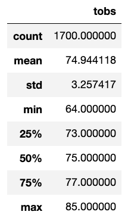
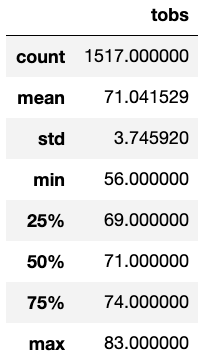

# surfs_up
Module 9 will focus on SQLite, SQLAlchemy, and Flask to build knowledge on SQL

### Overview:

The purpose of the statistical analysis is to explore the temperature trends around the months of June and December in Oahu before opening the Surf n' Shake shop business as requested by the investor backer named W. Avy. The analysis is done to assess if the surf and ice cream shop business is sustainable year-round.

### Results:

The three key differences in weather between June and December are listed below:

•	*The mean temperature in December (71.0) is lower by 3 degress because it is winter season compared to the summer season mean temperature in June (74.9).*

• 	*The count for June is (1700) and December is (1517).* 

•	*Both June and December temperatures fluctuated.  The difference is that in June, the temperatures fluctuated from 64 to 85 degrees while in December, temperatures fluctuated from 56 to 83 degrees.*

Refer to the statistical results shown below:

June Summary Statistics:

December Summary Statistics:

### Summary: 

Based on the statistical analysis results, the overall picture does not show when these temperatures were taken during the day. The temperature could fluctuate and does not give a definitive answer. I would recommend to gather more data by looking at other months to determine when is the best time for the business based on number of tourist and local patronage. 
